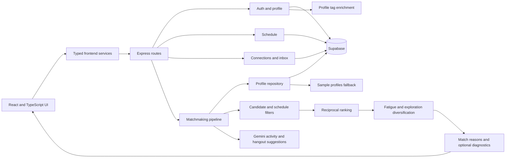

# Interlink

Interlink helps commuter students find people they are likely to connect with, compare shared availability, and turn individual recommendations into a group they choose themselves.

The current experience combines natural student profiles, schedule-aware one-on-one discovery, transparent match explanations, manual group building, connection requests, and AI-assisted meetup planning.

## Product flow

1. Create an account and complete a profile with a biography, major, classes, interests, hobbies, and what you are open to.
2. Add weekly availability with the calendar editor.
3. Request individual recommendations from the signed-in dashboard.
4. Read each profile as a social discovery card, including its biography, interests, classes, campus spot, availability, compatibility score, and match explanation.
5. Select people to build a group manually. Selected cards receive a distinct border and remain visible in the group summary.
6. Send connection requests or continue into the meetup-planning flow.

## Architecture



### Frontend

The `frontend/` application is a React 19, TypeScript, and Vite single-page app.

- `src/components/SignedInDashboard.tsx` owns recommendation requests, the profile timeline, manual group selection, and recommendation events.
- `src/components/matchmaking/MatchRankingDebug.tsx` renders environment-gated ranking diagnostics.
- `src/features/schedule/` contains the weekly calendar, saved-time summary, and schedule state management.
- `src/pages/ProfilePage.tsx` and `src/components/ProfileEditorForm.tsx` manage the profile data used by ranking.
- `src/services/` contains typed clients for auth, schedules, connections, and matchmaking.
- `src/context/AuthContext.tsx` provides the authenticated session to protected pages.

### Backend

The `backend/` application is an Express service organized by domain.

- `auth/` handles signup, signin, protected profile updates, avatar upload contracts, and enrichment status.
- `schedule/` stores canonical availability slots.
- `connections/` and `inbox/` manage friend requests and the connection graph.
- `matchmaking/data/profileRepository.js` selects Supabase data when configured and falls back to bundled profiles for local development.
- `matchmaking/services/matchService.js` orchestrates filtering, overlap checks, ranking, diversification, explanations, and response diagnostics.
- `matchmaking/services/rankingService.js` computes reciprocal profile affinity, intent, graph, confidence, fatigue, and exploration adjustments.
- `matchmaking/utils/bitmapSchedule.js` represents a week in 30-minute blocks for exact total and consecutive overlap calculations.
- `matchmaking/utils/matchmakingLogger.js` emits structured, request-correlated pipeline logs.
- `db/migrations/` contains the Postgres and Supabase schema history.

### Ranking pipeline

For each eligible candidate, the pipeline:

1. Removes the current user, existing friends, blocked candidates, and profiles that fail active filters.
2. Computes weekly overlap and rejects candidates below the requested consecutive-overlap cutoff.
3. Calculates profile affinity from IDF-weighted canonical tag overlap and class Jaccard similarity.
4. Combines reciprocal affinity, intent compatibility, graph signals, confidence, and schedule eligibility into a base rank.
5. Applies recent-impression fatigue and an explicit exploration boost.
6. Diversifies the final list and generates concrete `whyMatched` statements from shared profile and schedule evidence.

This path currently does not call an embedding model. When frontend diagnostics are enabled, embedding similarity is reported as `not used` so tag affinity is never mislabeled as an embedding score.

## Main features

- Natural sample profiles with distinct biographies, interests, hobbies, classes, campus locations, and social intent.
- Individual recommendation cards designed for profile browsing instead of automatic grouped results.
- Manual group selection with persistent selected-card styling and a live selected-people count.
- Human-readable match reasons based on actual shared tags, classes, intent, and availability.
- Exact weekly and consecutive schedule-overlap calculations.
- Exploration and fatigue controls that prevent every run from returning an identical top five.
- Structured matchmaking logs that trace dataset selection, filtering, ranking, diversification, LLM behavior, and failures.
- Optional per-card frontend diagnostics for candidate IDs and every major ranking component.
- Supabase-backed auth, profiles, schedules, and connections with local stub or sample fallbacks.
- Gemini activity suggestions and hangout plans with deterministic fallback behavior.
- Redis-compatible top-match caching with profile-version invalidation.

## Local development

### Prerequisites

- Node.js 20 or newer
- npm
- Optional: Supabase, Gemini, DeepSeek, and Redis credentials

### Setup

```bash
npm install
npm --prefix backend install
npm --prefix frontend install

cp backend/env.example backend/.env
cp frontend/env.example frontend/.env.local

npm run dev
```

The root development command starts:

- Frontend: `http://localhost:5173`
- Backend: `http://localhost:3001`

Leaving Supabase credentials empty uses the in-memory stub and bundled matchmaking data where supported.

### Seed natural profiles

With Supabase credentials configured in `backend/.env`:

```bash
npm --prefix backend run seed:dummy
```

Remove those seeded profiles with:

```bash
npm --prefix backend run seed:dummy:cleanup
```

## Configuration

### Frontend

| Variable | Default | Purpose |
| --- | --- | --- |
| `VITE_BACKEND_URL` | `http://localhost:3001` | Express API base URL |
| `VITE_ACTIVITY_AI_ENABLED` | `true` | Shows or hides AI activity suggestions |
| `VITE_MATCHMAKING_DEBUG` | `false` | Shows per-candidate ranking diagnostics |

Vite reads these values when the development server starts. Restart Vite after editing `.env.local`.

When `VITE_MATCHMAKING_DEBUG=true`, each recommendation shows:

- Similarity-ranked or exploration-boosted selection mode
- Candidate UUID and algorithm version
- Final and base rank scores
- Display fit, confidence, profile affinity, and reciprocal affinity
- Directional tag, class, intent, graph, fatigue, and exploration components
- Recent impressions and schedule overlap
- Similarity strategy, shared canonical tags, and embedding status

Keep this flag disabled in normal user-facing builds.

### Backend

| Variable | Purpose |
| --- | --- |
| `PORT` | Express port, default `3001` |
| `CLIENT_ORIGIN` or `ALLOWED_ORIGINS` | Comma-separated browser origins allowed by CORS |
| `SUPABASE_URL` | Supabase project URL |
| `SUPABASE_SERVICE_ROLE_KEY` | Server-side Supabase credential |
| `SUPABASE_USE_STUB` | Forces the in-memory Supabase implementation |
| `MATCHMAKING_LOG_LEVEL` | `debug`, `info`, `warn`, `error`, or `off` |
| `GEMINI_API_KEY` and `GEMINI_MODEL` | Activity and hangout suggestion provider |
| `DEEPSEEK_API_KEY` and related variables | Optional profile tag enrichment provider |
| `REDIS_URL` | Optional top-match cache |

Never commit populated `.env` or `.env.local` files.

## Matchmaking diagnostics

Backend observability is controlled separately from the frontend panel:

```env
MATCHMAKING_LOG_LEVEL=debug
```

Debug logging emits newline-delimited JSON for each candidate decision and score component. Matchmaking responses include an `X-Matchmaking-Request-Id` header and a matching `requestId` field. Use that ID to reconstruct one request across dataset loading, filtering, schedule checks, ranking, diversification, provider calls, and completion.

Sensitive values such as emails, biographies, prompts, credentials, tokens, and raw provider responses are redacted or bounded. See [`backend/matchmaking/OBSERVABILITY.md`](backend/matchmaking/OBSERVABILITY.md) for the event catalog.

## API overview

The backend is mounted directly at `http://localhost:3001` without an `/api` prefix.

| Method | Endpoint | Purpose |
| --- | --- | --- |
| `POST` | `/auth/signup` | Create an account |
| `POST` | `/auth/signin` | Create a session |
| `GET`, `PATCH` | `/auth/profile` | Read or update the authenticated profile |
| `GET`, `PUT`, `DELETE` | `/schedules/:userId` | Read, replace, or clear availability |
| `POST` | `/matchmaking/matches` | Generate individual recommendations |
| `POST` | `/matchmaking/events` | Record recommendation impressions and actions |
| `POST` | `/matchmaking/activity-suggestions` | Generate activity ideas |
| `POST` | `/matchmaking/hangout-plans` | Generate a meetup plan |
| `GET`, `POST`, `DELETE` | `/connections/*` | Manage requests and friendships |
| `GET` | `/inbox` | Read the authenticated inbox snapshot |

## Validation

```bash
npm --prefix backend test
npm --prefix frontend run lint
npm --prefix frontend run build
```

The backend uses Node's built-in test runner and Supertest. Frontend validation combines ESLint, TypeScript compilation, and a Vite production build.

## Repository map

```text
interlink/
|-- backend/
|   |-- auth/
|   |-- connections/
|   |-- db/migrations/
|   |-- inbox/
|   |-- matchmaking/
|   |-- schedule/
|   `-- tests/
|-- frontend/
|   |-- public/assets/
|   `-- src/
|       |-- components/
|       |-- context/
|       |-- features/schedule/
|       |-- pages/
|       |-- services/
|       `-- styles/
|-- CODE_AUDIT.md
`-- docker-compose.yml
```

## Further documentation

- [`backend/matchmaking/README.md`](backend/matchmaking/README.md)
- [`backend/matchmaking/OBSERVABILITY.md`](backend/matchmaking/OBSERVABILITY.md)
- [`backend/README-auth.md`](backend/README-auth.md)
- [`backend/README-connections.md`](backend/README-connections.md)
- [`CODE_AUDIT.md`](CODE_AUDIT.md)
